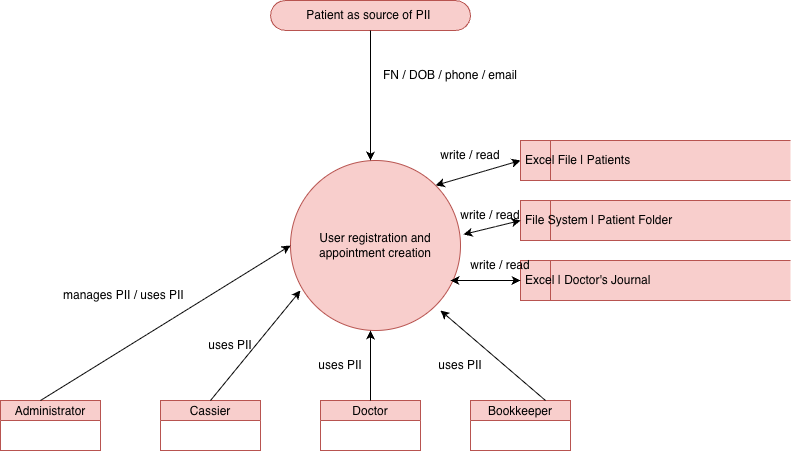
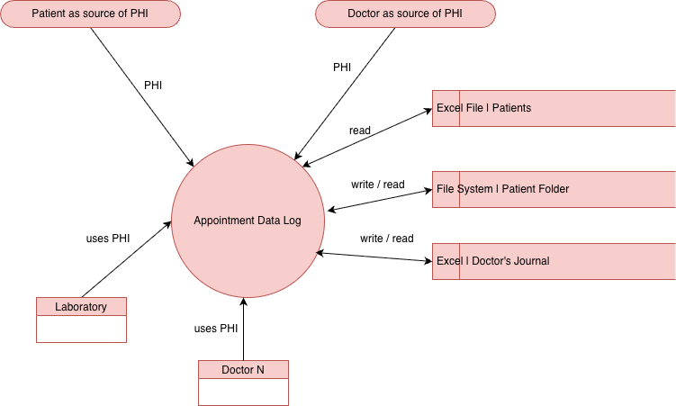
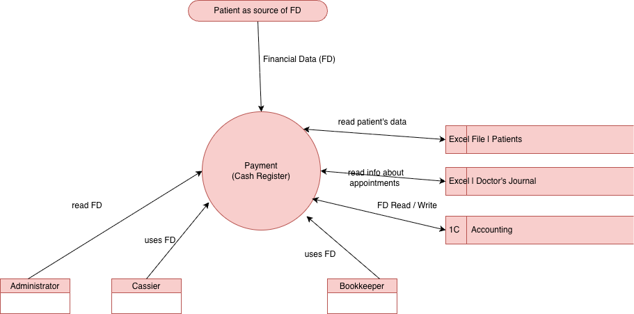
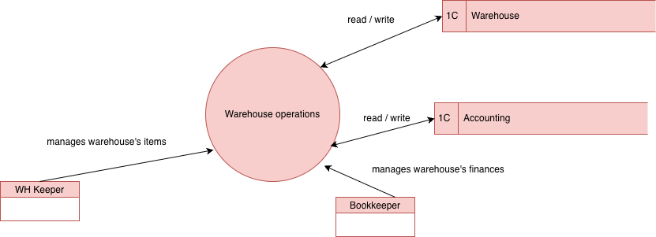
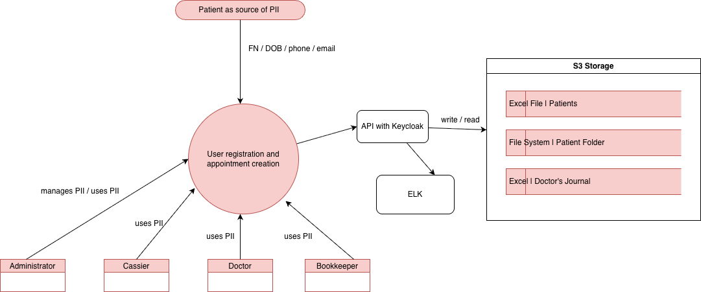
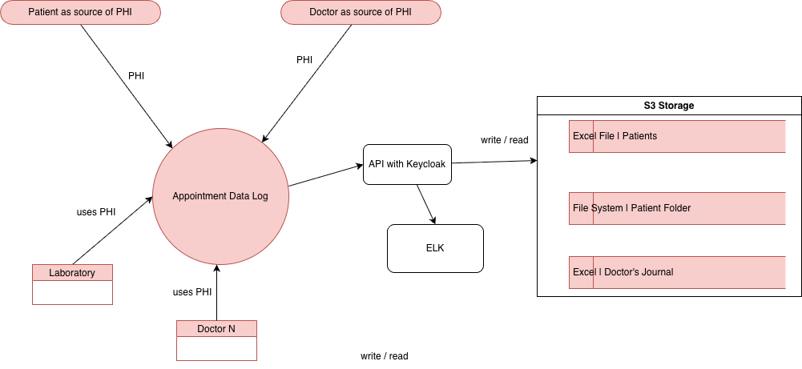
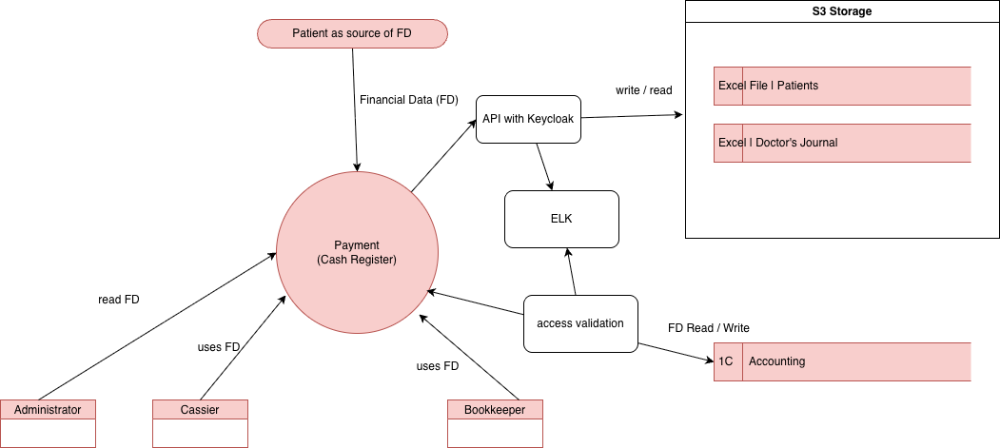
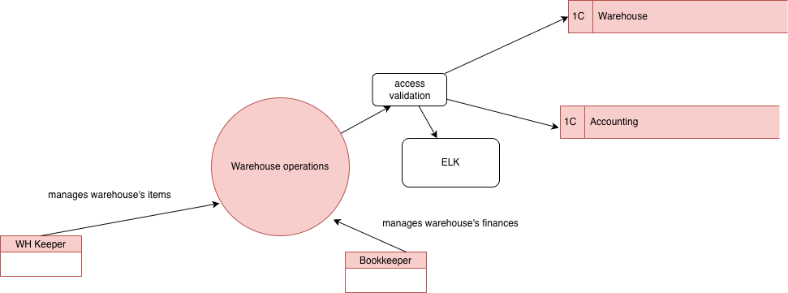

1. Данные, которые не учтены во внутренних системах: 
- emails и attachments 
- сканы документов на локальных компьютерах
- excel документы
- 1C данные 

Было выделено 4 диаграммы потоков данных: 
1.1. Диаграмма, показывающая взаимодействия с персональными данными пользователя  
  
1.2. Диаграмма, показывающая взаимодействия с медицинской информацией пользователя  
  
1.3. Диаграмма, показывающая взаимодействия с платежными данными  
  
1.4. Диаграмма, показывающая взаимодействия со складскими данными в 1С  
  

2. Аудит мер по обеспечению безопасности данных
- конфиденциальные данных пользователей не защищены и к ним могут иметь доступ любые сотрудники клиники
- данные пользователей могут быть скопированы / продублированы вне сервера клиники 
- доступ к медицинской тайне пациентов имеют все сотрудники клиники 
- любые данные пациента, его мед карта, данные о визитах и об оплатах могут уничтожены или изменены
- нет аудита на чтение / запись данных
- система не расширяема 
- нет единого места хранения конфиденциальных данных 
- нет структурированности в данных

3. Что можно улучшить

Список используемых тегов 

| группа тегов                         | назначение                                                         |
|--------------------------------------|--------------------------------------------------------------------|
| pii_patient, phi_patient, fd_patient | теги для группировки конфиденциальных данных пациента              |
| pii_clinic, fd_clinic                | теги для группировки конфиденциальных данных клиники и сотрудников |
| low, medium, high, critical          | уровень чувствительности данных                                    |
| actual, expired                      | тег для указания неактуальных данных или устаревших                |

| Категория данных   | Примеры данных                                   | Способы защиты                                                                                            | Теги                                    |
|--------------------|--------------------------------------------------|-----------------------------------------------------------------------------------------------------------|-----------------------------------------|
| Персональные (PII) | ФИО, дата рождения, телефон, email               | Шифрование для хранения и передачи, обфускация для визуализации, обезличивание для анализа или отчетности | pii_patient, critical                   |
| Медицинские (PHI)  | результат осмотра, диагнозы, анализы, назначения | Шифрование для хранения и передачи, обфускация для визуализации, обезличивание для анализа или отчетности | phi_patient, critical                   |
| Финансовые (FD)    | платежи, договоры, реквизиты                     | Шифрование                                                                                                | fd_patient, critical                    |
| Документы/сканы    | паспорта, договоры, чеки                         | Шифрование, водяные знаки                                                                                 | pii_patient, pii_clinic, high, expired  |
| Email/attachments  |                                                  | Шифрование, обезличивание                                                                                 | all                                     |
| Данные склада      |                                                  | -                                                                                                         | actual, expired, low, medium, fd_clinic |

Список инструментов и мер для защиты данных
- AES‑256, TLS для шифрования и передачи данных
- Keycloak, Spring Security для настоек доступа по ролям
- Apache Atlas, Collibra для тегирования данных
- настройка retention policy для неактуальных или устаревших данных
- ELK стек для настоек мониторинга и аудита
- запрос и хранение только минимально-необходимых данных пациентов
- логирование запросов данных и шаринга данных между системами

Обновленные диаграммы потоков данных:
1.1. Файлы помещаются на S3 и настраивается доступ только через api. Api сам проверяет возможность доступа к тем или иным данным по токену
  
1.2. Доступ доктора или лаборатории допускается после проверки ролей и доступов. Все операции логируются
  
1.3. Доступ к файлам такой же, как в п1 и п2. Использование стандартных политик безопасности 1С, аудит
  
1.4. Доступ к файлам такой же, как в п1 и п2. Использование стандартных политик безопасности 1С, аудит
  